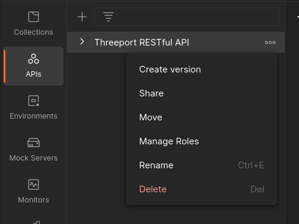
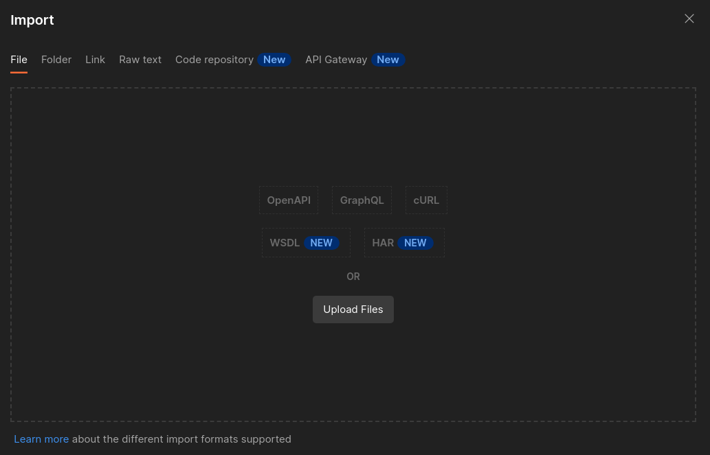
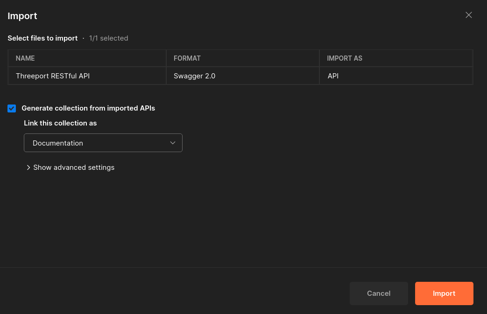
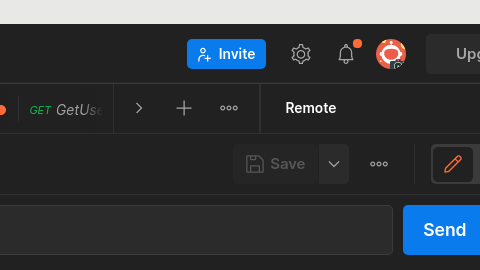
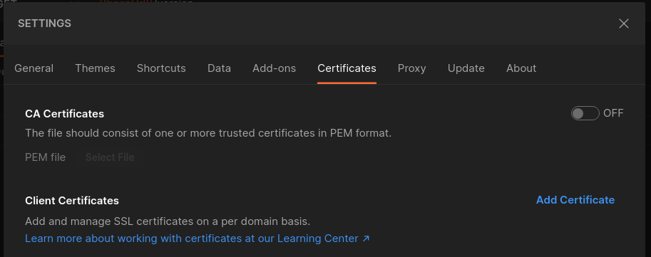
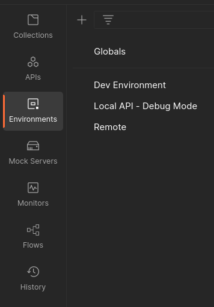
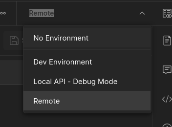

# Postman Setup

This document contians instructions for setting up the
[Postman](https://www.postman.com/) client for local testing and development of
the Threeport API.

## Importing Threeport API Definition

This section covers importing the Threeport API swagger definition into Postman.
Ensure you have any new structs properly defined (with comments) and that you
have run `make generate` to generate all boilerplate.

### Delete Existing APIs & Collections

Select "APIs" on left pane and then click the three dots on the left of any
existing "Threeport RESTful API" menu items and "Delete."

Do the same with any existing "Collections" for the Threeport API.



### Import Swagger Definition

Select "Collections" on left pane and then "Import".


Click "UploadFiles" and navigage to the file
`pkg/api-server/v0/docs/swagger.json` in this repo.



Click "Import".



Once complete, you'll be prompted to "Confirm and Close".

Now you can go to your new collection and find all the endpoints available in
the Threeport API.

## Postman with Remote Threeport Instances

If using Postman to do dev and testing on a remote threeport instance with auth
enabled, follow these instructions to set it up.

These instructions assume you have a threeport config that contains the
credentials to the threeport instance, such as if you used `tptctl up -p eks`
to provision it.

### Generate Creds

Build the tptdev tool:

```bash
make build-tptdev
```

Use that tool to get the credentials:

```bash
./bin/tptdev get-creds -n <threeport instance name>
```

This will write the CA, client cert and key to your working directory.

### Import into Postman

Click the cog icon at the top-right of the Postman client and select "Settings."



In the Settings window, select the "Certificates" tab.  Then click "Add
Certificate."



For the "Host" enter the hostname for the remote endpoint.  If a cloud provider
load balancer is used, you can get that value as follows:

```bash
kubectl get svc -n threeport-control-plane threeport-api-server -o jsonpath='{.status.loadBalancer.ingress[0].hostname}'
```

For "CRT file" select the file generated by `tptdev` called `[instance
name]-client.crt`.

For the "KEY file" select the file generated by `tptdev` called `[instance
name]-client.key`.

Click "Add."

### Set Postman Environment

On the left panel, select "Environments."



Select an existing environment or create a new one.

For the "baseURL" variable add or update the "CURRENT VALUE" to
`https://[hostname]`.  This is the same hostname as entered for the host in the
Certificates section (minus the protocol).

Now, when making calls to an endpoint, select the environment from the drop-down
at top-right.



